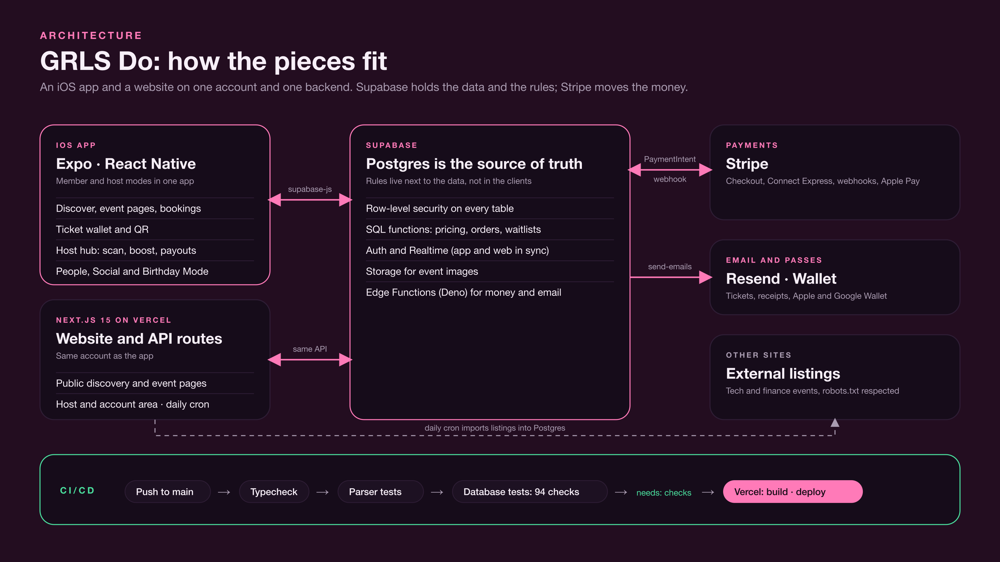

# GRLS Do

Women-focused event discovery and ticketing platform built under NUO Tech.

GRLS Do helps women discover, book and attend events, while giving organisers the tools to manage listings, ticketing, attendees and event operations.

> **Production source code is private.** This repository is a showcase only: it contains documentation, diagrams and screenshots.

## Tech stack

React Native / Expo · Next.js · TypeScript · Supabase (Postgres) · Stripe · Vercel · GitHub Actions

## Engineering highlights

- Cross-platform iOS and web experience from a shared codebase
- Event discovery and booking flows
- In-app ticket wallet with unique QR tickets
- QR-based attendee check-in using the organiser app
- Organiser dashboard for events, attendees, revenue and analytics
- Waitlist and ticket-resale matching based on ticket quantity
- User profiles, following and attendee group chats
- Birthday Mode with personalised event discovery
- Different fee logic for GRLS Do Originals, third-party paid events and free events
- CI/CD pipeline using GitHub Actions with controlled production deployments

## Screenshots

| Booking flow | Ticketing | Organiser dashboard |
| --- | --- | --- |
|  |  |  |

## Architecture

High-level architecture and selected technical flows are documented in [`/docs`](docs/). Production implementation, credentials and proprietary business logic are intentionally kept private.

## Live product

**[View GRLS Do → grlsdo.com](https://grlsdo.com)**
