# GRLS Do

**Things to do. People to do them with.**
A social events marketplace made for women: Eventbrite meets Meetup. Members discover and book mixed, women-focused and women-only events, then, only if they choose to, see who else is going, connect and message. Organisers list for free and get ticketing, payouts, guest lists and promotion tools.

> Commercial product built under NUO Tech. **Production source code is private.** This repository is a showcase of the product, the design and the engineering behind it.

### [View the live product →](https://grlsdo.com)

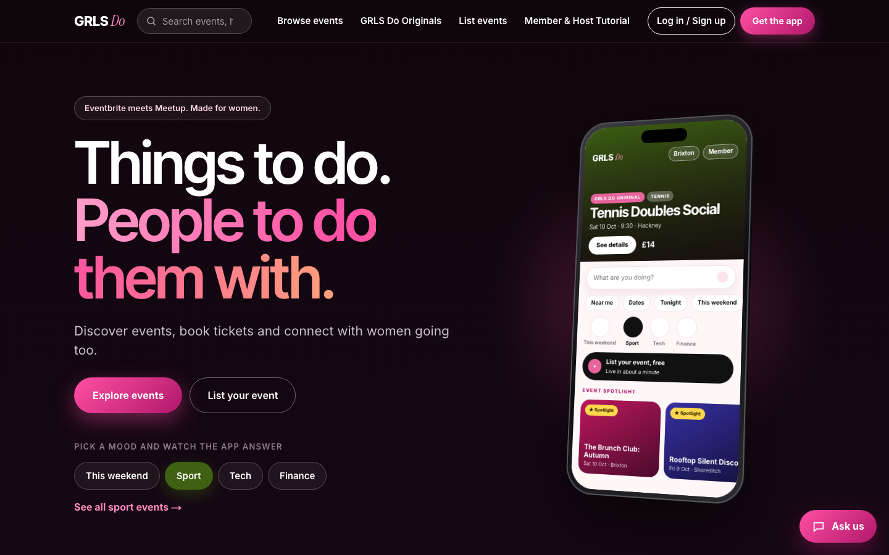

## What it is

- **An iOS app** (Expo / React Native) for members and hosts, with a Member / Host switch in the header.
- **A website** (Next.js) for public event discovery, event and organiser pages, and the host and account area.
- **One account, one backend.** The app and the website read and write the same Supabase database, with realtime updates so a change on one shows up on the other within seconds.

## The app

Shown running on an iPhone simulator with the built-in demo data.

<table>
  <tr>
    <td align="center" width="33%">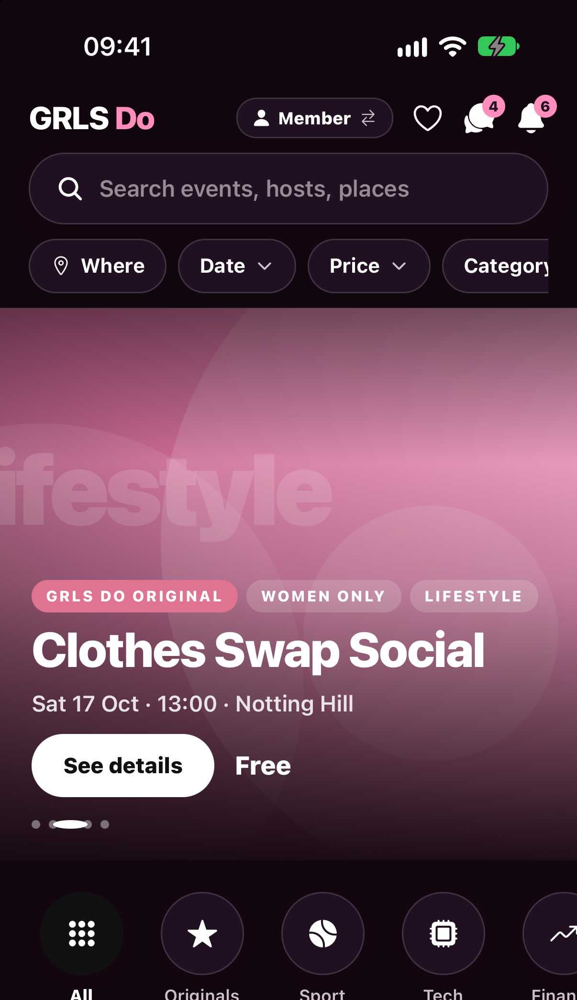 <b>Discover</b> Mood, date and price filters, Originals and a spotlight carousel</td>
    <td align="center" width="33%">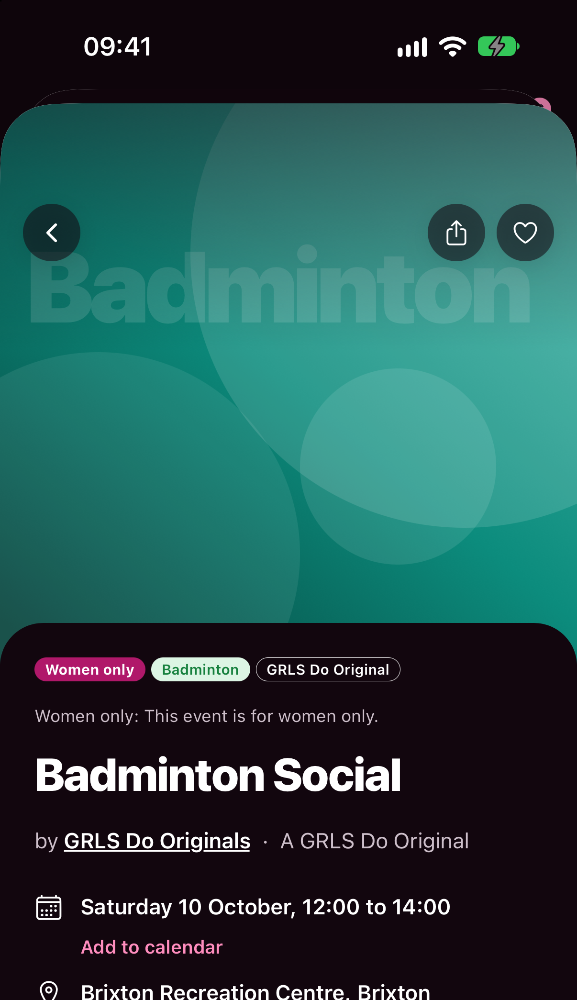 <b>Event page</b> Clear tags, who is hosting, and an upfront price</td>
    <td align="center" width="33%">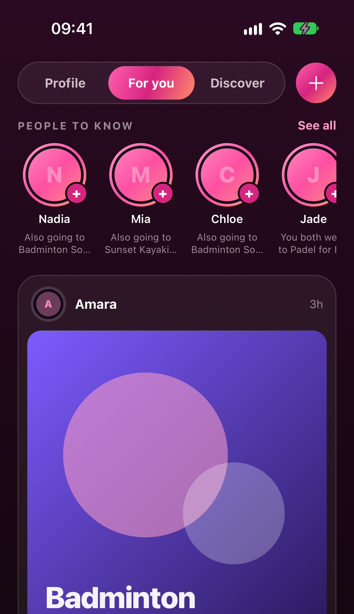 <b>Social</b> For you, Discover and your own profile, in a plum look of its own</td>
  </tr>
  <tr>
    <td align="center" width="33%">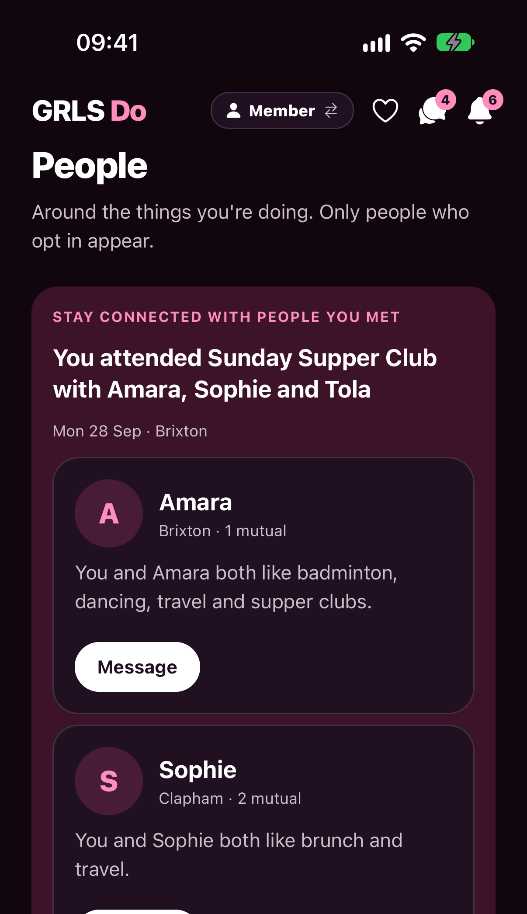 <b>People</b> Only people who opted in appear, matched on shared interests</td>
    <td align="center" width="33%">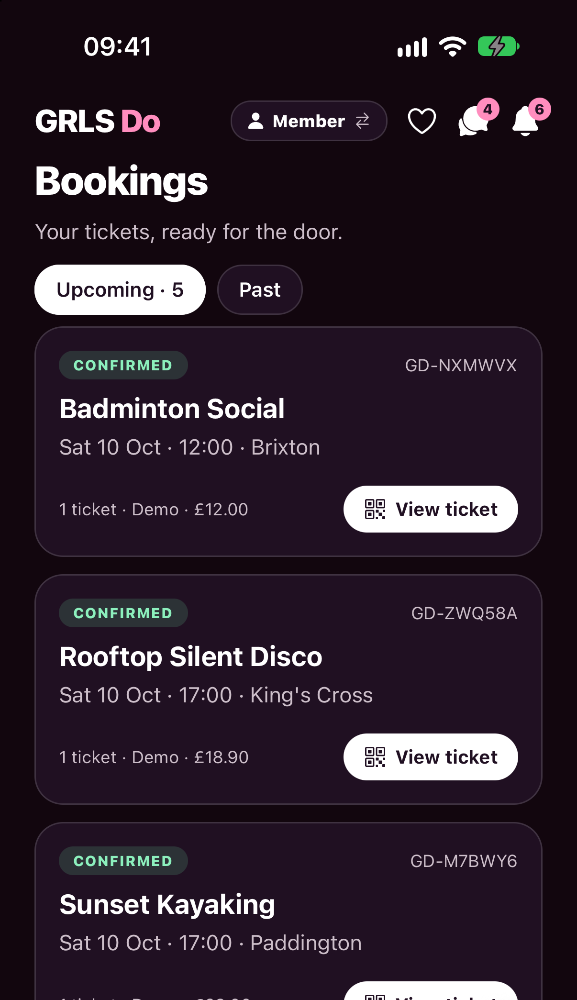 <b>Bookings</b> Tickets ready for the door, with a QR to scan</td>
    <td align="center" width="33%">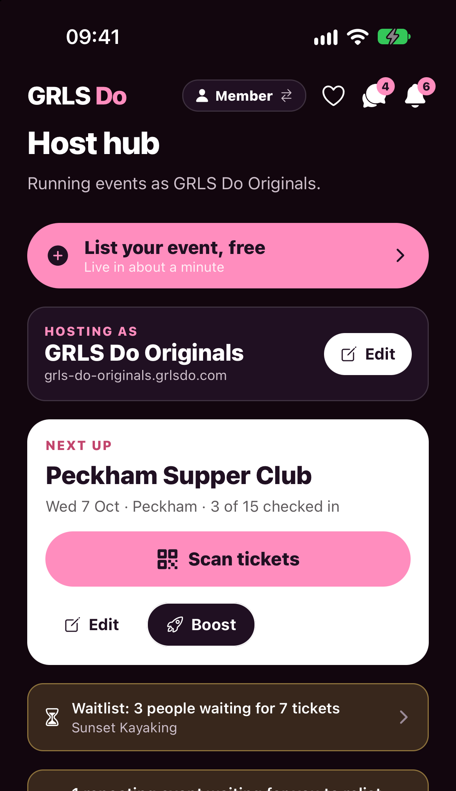 <b>Host hub</b> Scan tickets, boost, waitlists and revenue in one place</td>
  </tr>
</table>

## The website

  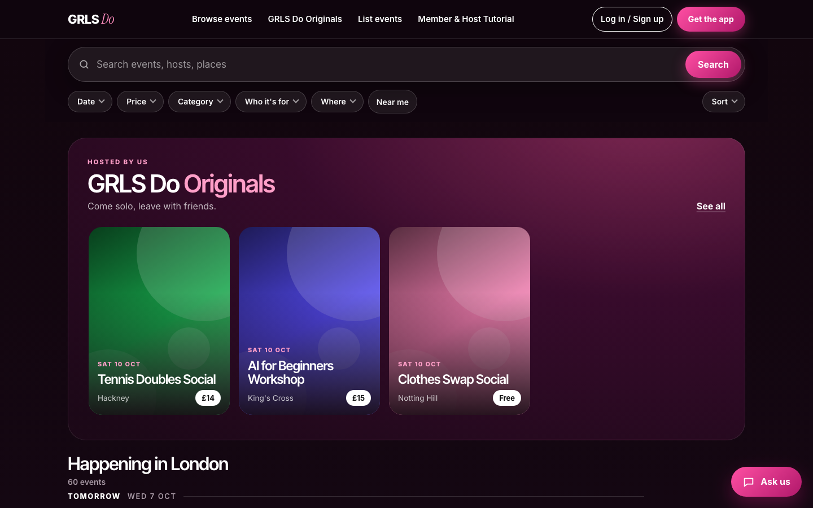
  &nbsp;
  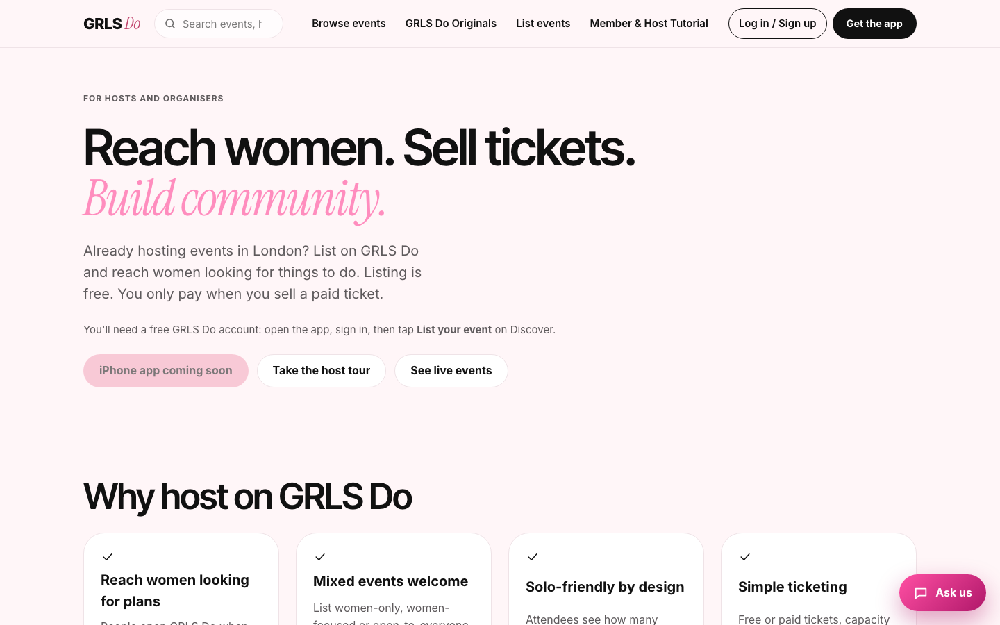

## Stack

| Layer | Technology |
| --- | --- |
| iOS app | Expo SDK 57, React Native 0.86, Expo Router, TypeScript |
| Website | Next.js 15 (App Router), React 19, TypeScript |
| Backend | Supabase: Postgres with row-level security, Auth, Realtime, Storage, Edge Functions (Deno) |
| Payments | Stripe (Checkout, Connect Express, webhooks), Apple Pay |
| Email, tickets and passes | Resend, QR tickets, Apple and Google Wallet passes |
| Hosting and delivery | Vercel (web and cron jobs), GitHub Actions |
| Structure | npm workspaces monorepo: app, web, and shared `api`, `types`, `ui` and `validation` packages |
| Quality gates | Typecheck, parser tests and 94 database checks on every push and pull request |

## Engineering highlights

- **Privacy-first social layer.** Nobody is visible to other attendees until they opt in, per event. Connections are mutual (request, then accepted) and messaging only opens after that. Buying a ticket never exposes the buyer, and date of birth, email and exact location are never returned by a social query.
- **The backend decides what you pay.** The app shows the quote the server returns, and checkout recomputes it server-side before charging. GRLS Do Originals carry no booking fee, other hosts' paid tickets show their fee in the total up front, and free tickets never have one.
- **One refund policy, enforced by the backend.** Refund within 24 hours of buying, or if the event is cancelled or rescheduled. Eligible refunds are approved automatically. Hosts agree to the policy before an event goes live.
- **Fair waitlists and resale.** Sold-out events get a waitlist (1 to 6 tickets). When tickets free up, they are offered in timed waves: the biggest group that fits first, oldest first within a size, with a claim window. Sellers get their ticket price and their own fee back when it sells.
- **Organisers get paid properly.** One-tap Stripe Connect Express onboarding, with sales, refunds, fees, balance and payouts read from the organiser's own Stripe account. Bank details never touch GRLS Do.
- **Security by default.** Every table has row-level security, privileged ticket and payment work runs in Edge Functions, and the SQL is covered by database tests that run against a real embedded Postgres in CI.
- **Always something to do.** GRLS Do Originals alongside organiser events, plus a daily job that imports tech and finance listings from other sites while respecting `robots.txt`. In-person and virtual events, with joining links shared only with ticket holders.
- **Extras that feel finished.** QR check-in, Apple and Google Wallet passes, Birthday Mode plans with reminders, Event Spotlight boosts, organiser pages and follow alerts.
- **CI/CD.** Typecheck, parser tests and database tests must pass before a push to `main` is deployed to Vercel, using the Vercel CLI (`pull`, `build`, `deploy --prebuilt`). Pull requests get a preview deployment.

## Architecture

## Ticketing flow: from Get ticket to a ticket in your wallet

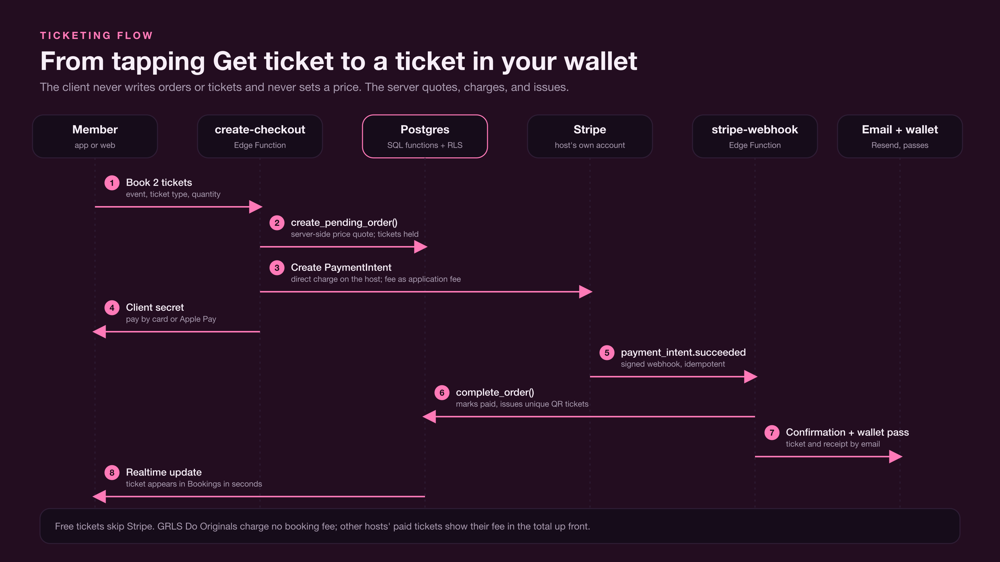

## Waitlists and resale

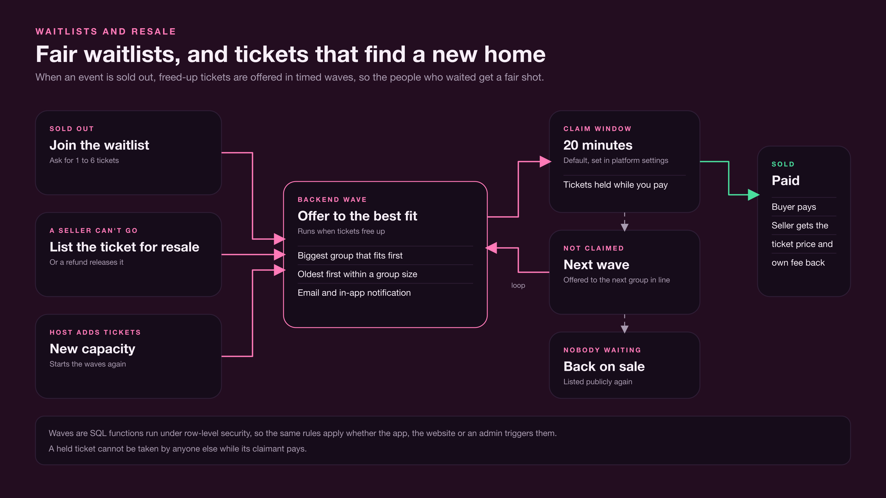

## Data model

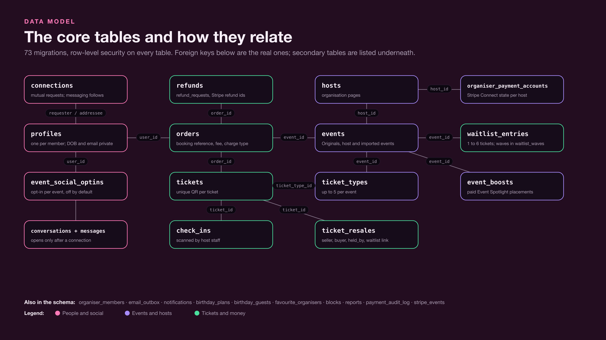

## Status

The website is live at [grlsdo.com](https://grlsdo.com). The iOS app is in pre-launch development.
